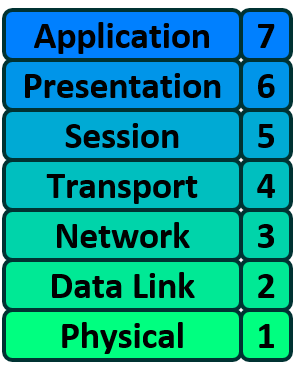

# OSI: The Reference Model

The OSI model is divided into seven layers, each fulfilling a particular function. When combined, each function contributes to enabling full computer-to-computer data communication.

<figure><figcaption>
OSI Model
</figcaption></figure>

## OSI Layer 1 – Physical 

The Physical layer of the OSI model is responsible for the transfer of bits — the 1’s and 0’s which make up all computer code.

Simply put, Layer 1 is anything that carries 1’s and 0’s between two nodes.&#x20;

The actual format of data on the "wire" varies depending on the medium. For Ethernet, bits are transferred as electric pulses; for WiFi, as radio waves; and for Fiber, as pulses of light.

<figure><figcaption>
Physical layer: medium
</figcaption></figure>

Apart from the physical cable, Repeaters and Hubs also operate at this layer.

A Repeater simply repeats a signal from one medium to another, allowing a series of cables to be daisy-chained together and extending the distance a signal can travel beyond the limit of a single cable. They are commonly used in large WiFi deployments, where a single WiFi network is "repeated" across multiple access points to cover a larger area.&#x20;

A Hub is essentially a multi-port Repeater. When four devices are connected to a single Hub, any data sent by one device is repeated to the other three devices.

## OSI Layer 2 – Data Link 

